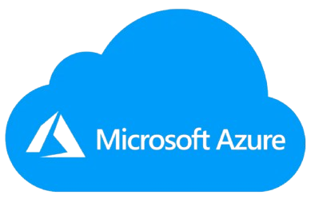

### <i> Criando Processos de Redundância de Arquivos na Azure. </i>

 

 

> #### 🎯 OBJETIVO DO PROJETO

- O objetivo desse projeto é criar um pipeline completo de redundância de arquivos utilizando recursos do <strong>Microsoft Azure</strong>.
- Nesse redme você encontrará um guia de como configurar toda a infraestrutura necessária com <strong>Azure Data Factory</strong>, <strong>SQL Server</strong> (local e na nuvem) e <strong>Azure Data Lake (Blob Storage)</strong>, movimentando dados entre esses ambientes, criando arquivos `.txt` organizados por camadas de dados em containers (`bronze`, `prata`, `ouro`).

---

### PASSO A PASSO DA CRIAÇÃO DO DESAFIO 

 &nbsp;&nbsp;&nbsp;&nbsp;&nbsp;🔹 Configurar a infraestrutura necessária no Azure Data Factory para conectar ambientes on-premises e na nuvem. 

 &nbsp;&nbsp;&nbsp;&nbsp;&nbsp;🔹 Implementar a extração de dados de uma tabela SQL Server local. 

 &nbsp;&nbsp;&nbsp;&nbsp;&nbsp;🔹 Transferir esses dados para o Azure Data Lake Storage. 

 &nbsp;&nbsp;&nbsp;&nbsp;&nbsp;🔹 Converter os dados em arquivos .TXT organizados em uma estrutura de camadas. 

 &nbsp;&nbsp;&nbsp;&nbsp;&nbsp;🔹 Validar, publicar e executar o pipeline de dados. 

 &nbsp;&nbsp;&nbsp;&nbsp;&nbsp;🔹 Analisar a performance e aplicar boas prática. 

---

> #### ✍️ Tipos de Redundância no Azure

- O Azure oferece diferentes tipos de redundância de arquivos, adequados para diversas necessidades de disponibilidade e desempenho:

  -🔹 <strong>LRS (Locally Redundant Storage):</strong> Armazena múltiplas cópias de dados dentro de um único datacenter na região escolhida. Adequado para proteção contra falhas de hardware locais.

  -🔹 <strong>GRS (Geo-Redundant Storage):</strong> Réplica de dados entre datacenters em regiões geograficamente isoladas, garantindo alta disponibilidade e recuperação em caso de falhas em uma região inteira.

  -🔹 <strong>ZRS (Zone-Redundant Storage):</strong> Garante redundância de dados entre múltiplas zonas de disponibilidade dentro de uma região, oferecendo proteção contra falhas de uma zona.

  -🔹 <strong>RA-GRS (Read-Access Geo-Redundant Storage):</strong> Semelhante ao GRS, mas com a adição de permitir o acesso de leitura aos dados replicados na região secundária, aumentando a resiliência.

  -🔹 <strong>GRS para Blobs:</strong> Proporciona redundância geográfica para arquivos no formato blob, garantindo que as versões de backup dos dados sejam mantidas fora da região principal.

---

> #### ⚙️ Configuração da Redundância de Arquivos no Azure

#### 1° - Criar uma Conta de Armazenamento

- Acesse o portal do Azure.
- No menu de navegação, clique em <b>Armazenamento</b> e depois em <b>Contas de Armazenamento</b>.
- Clique em <b>Adicionar</b> para criar uma nova conta de armazenamento e defina a redundância de dados desejada (LRS, GRS, ZRS, etc.).

#### 2° - Escolher o Tipo de Redundância

- Durante a criação da conta de armazenamento, selecione o tipo de redundância que atende suas necessidades. Por exemplo:
  - <b>LRS</b> para redundância local.
  - <b>GRS</b> para redundância geográfica.

#### 3° - Configuração de Blob Storage

- Para armazenar arquivos em formato de blob, crie um <b>contêiner</b> dentro da conta de armazenamento.
- Faça upload dos arquivos para o contêiner e garanta que o acesso aos dados siga as políticas de redundância configuradas.

#### 4° - Monitoramento e Gerenciamento

- Utilize ferramentas como o <b>Azure Monitor</b> para acompanhar o desempenho e o estado da redundância de arquivos.
- Configure alertas para receber notificações em caso de falhas no sistema de armazenamento.

#### 5° - Integrar com IA

- Utilize <b>Azure Machine Learning</b> ou <b>Azure Cognitive Services</b> para aplicar modelos de IA aos dados armazenados.
- Utilize <b>Azure AI</b> para otimizar a distribuição de dados e aplicar análises preditivas para melhorar o processo de redundância.

---

> #### 🏗️ Construção do Processo de Redundância de Arquivos na Azure

#### 1° - Criar Recursos no Azure

- Azure Data Factory (ADF).
- Azure SQL Database.
- Azure Blob Storage.
  - Criar containers: `bronze`, `prata`, `ouro`

#### 2° - Preparar o Ambiente On-Premises (local)

- Ter o SQL Server local com banco e tabelas disponíveis.
- Verificar acesso administrativo ao servidor para configurar o Integration Runtime.

#### 3° - Configurar Integration Runtime Self-hosted

- No Azure Data Factory, vá em <b>Manage >> Integration Runtimes >> New</b>.
- Escolha <b>Self-hosted\*\* e siga o assistente:
  - Baixe o instalador (modo express ou manual).
  - Instale no servidor local (on-premises).
  - Configure com a chave gerada pelo ADF.
  - Verifique se o status está como “Running”.

#### 4° - Criar Linked Services

##### 4.1 Para o SQL Server On-Premises

- Vá em <b>Manage >> Linked Services >> New >> SQL Server</b>.
- Utilize o Integration Runtime criado.
- Insira servidor, banco, autenticação e teste a conexão.

##### 4.2 Para o Azure SQL Database

- Criar outro Linked Service apontando para o banco na nuvem.

##### 4.3 Para o Azure Blob Storage

- Criar um Linked Service usando a Storage Account.
- Inserir a chave de acesso da conta.

#### 5° - Criar Datasets

##### 5.1 Dataset de Origem

- Criar um dataset do tipo <b>SQL Server Table</b>.
- Escolher o Linked Service do SQL Server on-premises.
- Definir a tabela que será copiada.

##### 5.2 Dataset de Destino

- Criar um dataset do tipo <b>DelimitedText (.txt)</b>.
- Escolher o Linked Service do Blob Storage.
- Apontar para o container/caminho desejado (`bronze`, `prata`, `ouro`).
- Configurar delimitador e nome do arquivo.

#### 6° - Criar Pipeline de Cópia

##### 6.1 Construir o Pipeline

- No Data Factory, ir para <b>Author > Pipelines > New pipeline</b>.
- Adicionar a atividade <b>Copy Data</b>.
  - <b>Source (origem)</b>: Dataset do SQL Server local.
  - <b>Sink (destino)</b>: Dataset no Blob Storage.
  - Nomear e salvar.

##### 6.2 Validar e Publicar

- Clique em <b>Validate</b> para checar erros.
- Clique em <b>Publish All</b> para aplicar mudanças.

#### 7° - Executar e Monitorar

##### 7.1 Executar Pipeline

- Rodar o pipeline manualmente (<strong>Debug</strong>) ou configurar um trigger (<strong>Trigger Now</strong>).

##### 7.2 Verificar Resultados

- Vá até o container do Azure Blob Storage.
- Verifique se o arquivo `.txt` foi gerado com sucesso.

##### 7.3 Analisar Performance

- No painel do Data Factory, abra a aba <b>Monitor</b>.
- Verifique duração da execução, throughput, logs e outras informações.

---

> #### Benefícios da Redundância de Arquivos no Azure

- <b>Alta Disponibilidade</b>: A redundância assegura que os dados estejam sempre acessíveis, mesmo em situações de falha.
- <b>Proteção contra Perda de Dados</b>: Dados críticos são protegidos contra falhas de hardware ou problemas de infraestrutura.
- <b>Escalabilidade</b>: O Azure oferece escalabilidade para acomodar grandes volumes de dados com redundância eficiente.
- <b>Custo-efetivo</b>: As soluções de redundância do Azure permitem balancear custo e segurança com opções como LRS e GRS.

---

> #### 🔗 Link para Administrar as aplicações

- [Microsoft Azure](https://portal.azure.com/#home)

---

> #### 🛠️ Ferramentas utilizadas

- 🌍 Microsoft Azure (ADF, SQL, Blob Storage)
- 💻 SQL Server
- 💻 Data Factory Integration Runtime
- 👩🏾‍💻 Azure Portal
- 🤖 VSCode

---

> #### 🧩 Tipo de desafio

- Básico.

---

> #### 🔗 Referências

- [Azure Storage](https://learn.microsoft.com/pt-br/azure/storage/)
- [Azure Databricks](https://azure.microsoft.com/pt-br/services/databricks/)
- [Azure Machine Learning](https://azure.microsoft.com/pt-br/services/machine-learning/)
- [Azure Monitor](https://azure.microsoft.com/pt-br/services/monitor/)

---

> #### 🏆 Créditos

  - ver mais em <a href="https://github.com/angelicakadja">AK</a>.

