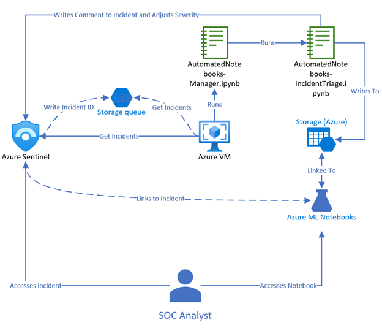

<div align='center'>

## <i> Controle e Versionamento de Código no Notebook da Azure. </i>


<br />



<b>Arquitetura notebook Azure</b>

</div>

> ### 🎯 Qual o objetivo do Controle e Versionamento de Código no Notebook da Azure?

- O Controle e Versionamento de Código no Notebook da Azure é essencial para garantir que todas as alterações feitas no código sejam registradas, além de garantir a integridade do código e facilitar a colaboração entre equipes, ele permite:
  - <b>Registro de alterações</b>: Cada modificação no código é documentada, permitindo rastreamento e auditoria.
  - <b>Recuperação de versões anteriores</b>: Caso uma alteração cause problemas, é possível reverter para uma versão estável.
  - <b>Colaboração eficiente</b>: Múltiplos desenvolvedores podem trabalhar simultaneamente sem conflitos.
  - <b>Automação de processos</b>: Integração com pipelines de CI/CD para testes e implantação contínua.
  - <b>Integração com</b> <strong>Git e Azure DevOps</strong>: Os notebooks podem ser conectados a repositórios Git, facilitando commits, branches e mesclagens.
  - <b>Automação com</b> <strong>CI/CD</strong>: Permite que cada alteração seja testada e implantada automaticamente, reduzindo riscos e agilizando entregas.
  - <b>Histórico e rastreamento</b>: Mantém um registro completo das versões, facilitando auditoria e reversão para versões anteriores.
  - <b>Colaboração entre equipes</b>: Desenvolvedores podem trabalhar simultaneamente no mesmo código sem conflitos.

---

> ### 👩🏽‍💻 Como criar um novo Azure Notebook?

1. <b>Para iniciar comece com essas 4 etapas abaixo:</b>

   1. Go to the Azure Notebooks website: <https://notebooks.azure.com/>.
   2. Click the <b>Create notebook</b> button.
   3. In the <b>Create notebook</b> dialog box, select the language and kernel you want to use.
   4. Click the <b>Create</b> button.

2. <b>Escrever código em um Azure Notebook</b>:<br/>
   Os Azure Notebooks são compostos por células, cada célula pode conter texto ou código.<br/>
   Para escrever código em uma célula, clique nela e comece a digitar.<br/>
   A célula estará no modo de edição, ao terminar de digitar, pressione Shift+ Enter para executar o código.

3. <b>Adicionar texto a um Notebook do Azure</b>:<br/>
   Para adicionar texto a um Caderno do Azure, clique em uma célula e comece a digitar, a célula estará no modo de edição.<br/>
   Você pode criar seu texto usando a sintaxe Markdown, por exemplo, para criar um título, você digitaria:

   ```This is a heading
   Para adicionar uma imagem, você digitaria:

   
   ```

4. <b>Executar um notebook do Azure</b>:<br/>
   Para executar Notebook do Azure, clique na célula que contém o código que você deseja executar e pressione Shift+ Enter.<br/>
   O código será executado e a saída será exibida na célula abaixo.

5. <b>Salvar um notebook do Azure</b>:<br/>
   Para salvar um Notebook do Azure, clique no File menu e selecione Save.<br/>
   O notebook será salvo no diretório atual.

6. <b>Compartilhe um Notebook do Azure</b>:<br/>
   Para compartilhar um Notebook do Azure, você pode exportá-lo como um arquivo PDF ou HTML.<br/>
   Você também pode publicá-lo em um servidor web.

7. <b>Conectar-se aos recursos do Azure</b>:<br/>
   Os Notebooks do Azure podem ser usados ​​para se conectar a recursos do Azure, como o Armazenamento do Azure, o Banco de Dados SQL do Azure e o Azure Machine Learning.<br/>
   Para se conectar a um recurso do Azure, você precisa criar uma string de conexão.<br/>
   Você pode encontrar a string de conexão do seu recurso do Azure no portal do Azure.

8. <b>Use Azure Notebooks com outras ferramentas</b>:<br/>
   Os Azure Notebooks podem ser usados ​​com outras ferramentas, como o Visual Studio Code e o JupyterLab.<br/>
   Você pode usar essas ferramentas para editar e executar os Azure Notebooks.

- <b>Dicas para usar o Azure Notebooks</b>:
  - Use os atalhos do teclado para navegar pelo notebook e executar o código.
  - Formate seu texto usando a sintaxe Markdown.
  - Adicione imagens e outras mídias aos seus cadernos.
  - Organize seus cadernos em pastas.
  - Use o controle de versão para rastrear alterações em seus notebooks.

---

> ### ✍️ Como efetuar o controle e versionamento de código em um notebook do Azure?

1. <strong>Azure Repos</strong>:</br>
   Utilize o Azure Repos para hospedar seu repositório Git privado no Azure. Isso permite que você mantenha o controle de versões do seu código de forma segura.

2. <strong>Azure DevOps</strong>:</br>
   Integre o Azure DevOps para gerenciar o ciclo de vida de desenvolvimento de software. Ele oferece recursos como pipelines de CI/CD, gerenciamento de trabalho, controle de versões e mais.

3. <strong>Git</strong>:</br>
   Utilize o Git como seu sistema de controle de versão. Ele é amplamente suportado pelo Azure e permite um fluxo de trabalho eficiente para colaboração e versionamento de código.

4. <strong>Notebooks Azure</strong>:</br>
   e você estiver usando serviços específicos de notebooks no Azure, como o Azure Notebooks, você pode integrar diretamente com o Azure Repos para versionamento e colaboração.

5. <strong>VSCode com Extensões Azure</strong>:</br>
   Se preferir um ambiente mais integrado, o Visual Studio Code com extensões para Azure oferece suporte para controle de versão Git e integração com serviços Azure diretamente no editor.

---

> ### 🧩 Tipo de desafio

- Básico.

---

> ### 🔗 Referências

- [Introdução ao Azure Databricks](https://learn.microsoft.com/pt-br/training/modules/intro-to-azure-databricks/)
- [Engenharia de Dados com Azure Databricks](https://learn.microsoft.com/pt-br/training/paths/data-engineer-azure-databricks/)
- [Ciência de Dados com Azure Databricks](https://learn.microsoft.com/pt-br/training/paths/perform-data-science-azure-databricks/)
- [DevOps School](https://www.devopsschool.com/blog/what-is-microsoft-azure-notebooks-and-use-cases-of-microsoft-azure-notebooks/)

---

> ### 🏆 Créditos

<div align="left">  - ver mais em <a href="https://github.com/angelicakadja">AK</a>.</div>

</div>
