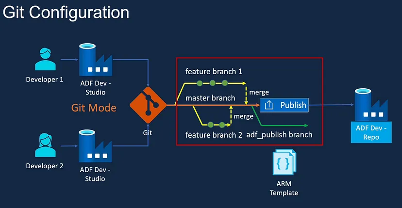

<div align='center'>

## <i> GitHub e Azure DevOps para versionamento e backups. </i>


<br />



<strong>Como configurar o Git no ADF - Azure Data Factory</strong>

</div>

> ### 🎯 Como criar um processo de um Data Factory no Azure DevOps?

- Criar um Azure Data Factory dentro do Azure DevOps envolve várias etapas que ajudam a automatizar e gerenciar pipelines de dados:

  <b>1. Configuração do Repositório no Azure DevOps:</b>
  Crie um repositório no <strong>Azure DevOps</strong> para armazenar os arquivos de configuração do <strong>Data Factory</strong>.<br/>
  Use <strong>Git</strong> para versionamento e controle das mudanças.

  <b>2. Criação do Azure Data Factory:</b><br/>
  No portal do <strong>Azure</strong>, vá até <strong>Data Factory</strong> e crie uma nova instância.<br/>
  Escolha a <b>Região</b>, o <b>Grupo de Recursos</b> e o <b>Nome do Data Factory</b>.

  <b>3. Desenvolvimento dos Pipelines:</b><br/>
  Dentro do <strong>Data Factory</strong>, crie <b>pipelines</b> para movimentação e transformação de dados.<br/>
  Configure <strong>Linked Services</strong> para conectar fontes de dados como <strong>SQL Database</strong>, <strong>lob Storage</strong> e APIs.

  <b>4. Integração com o Azure DevOps:</b><br/>
  Habilite o <b>Git Integration</b> dentro do <strong>Data Factory</strong> e conecte ao seu repositório do <strong>Azure DevOps</strong>.<br/>
  Isso permite que alterações feitas no <strong>Data Factory</strong> sejam registradas no <strong>Azure DevOps</strong>.

  <b>5. Criação do CI/CD para Implantação:</b><br/>
  No <strong>Azure DevOps</strong>, vá até <b>Pipelines</b> e configure um <strong>Pipeline de CI/CD</strong>.<br/>
  Use um arquivo <strong>YAML</strong> para definir <b>build</b> e <b>release pipelines</b>.<br/>
  Adicione tarefas para implantação do <strong>Data Factory</strong>, garantindo que mudanças sejam aplicadas automaticamente ao ambiente.

  <b>6. Monitoramento e Ajustes:</b><br/>
  Utilize o <strong>Azure Monitor</strong> para acompanhar a execução dos pipelines.<br/>
  Configure <b>alertas</b> e <b>logs</b> para detectar falhas e otimizar a performance.

  OBS:<br/>
  Esse fluxo garante um <b>desenvolvimento ágil</b>, versionamento adequado e implantação automatizada do <strong>Azure Data Factory</strong> dentro do <strong>Azure DevOps</strong>.

---

> ### 👩🏽‍💻 Qual a importância do CI/CD no Azure DevOps?

<div align='center'></div>

- O CI/CD (Continuous Integration/Continuous Deployment) é fundamental para modernizar o desenvolvimento de software e tornar o processo mais eficiente, veja os principais benefícios:<br/>

  <b>1. 🚀 Automação e Agilidade:</b><br/>
  O CI/CD automatiza builds, testes e deploys, reduzindo o trabalho manual.<br/>
  Isso acelera entregas e atualizações, permitindo feedback rápido e melhorias contínuas.

  <b>2. 🔄 Menos Erros e Maior Qualidade:</b><br/>
  O Continuous Integration garante que cada alteração de código seja testada antes de ser integrada ao projeto.<br/>
  Isso evita bugs e conflitos, assegurando código mais estável e de alta qualidade.

  <b>3. ⏳ Redução de Tempo e Custos:</b><br/>
  Com testes automatizados e implantação contínua, os times de desenvolvimento evitam retrabalho.<br/>
  Isso diminui custos operacionais e aumenta a produtividade.

  <b>4. 🛡️ Segurança e Confiabilidade:</b><br/>
  O CI/CD permite implementações seguras, testando cada nova versão antes da liberação.<br/>
  Atualizações podem ser feitas sem interrupções no serviço.

OBS:<br/>
Em resumo, CI/CD transforma o processo de desenvolvimento, tornando-o mais rápido, seguro e confiável.<br/>
Em ambientes como Azure DevOps, ele é essencial para projetos escaláveis e de alta performance.

---

###  detalhado para criar um Azure Data Factory integrado ao Azure DevOps, incluindo a configuração do repositório Git

<b>1. 📌 Criar o Azure Data Factory:</b>

1. Acesse o portal do <b>Azure</b> (<https://portal.azure.com>).
2. No menu superior, clique em Criar um recurso</b>.
3. Busque por <b>Data Factory</b> e selecione <b>Criar</b>.
4. Preencha os campos:
   - Nome do Data Factory
   - Grupo de Recursos (crie um novo ou selecione um existente)
   - Região
   - Versão Git (não configure ainda, faremos isso depois)
5. Clique em <b>Revisar + Criar</b> e, depois, em <b>Criar</b>.
6. Aguarde a implantação e, em seguida, acesse o recurso criado.

<br/>

<b>2. 🔗 Criar e Configurar o Repositório Git no Azure DevOps:</b>

1. Acesse o portal do <b>Azure DevOps</b> (<https://dev.azure.com>).
2. Crie um novo <b>Projeto</b> no <b>Azure DevOps</b>.
3. Vá até Repositórios e clique em <b>Novo repositório</b>.
4. Escolha:
   - Tipo: Git
   - Nome: Exemplo - `data-factory-repo`
5. Clique em <b>Criar</b>.

<br/>

<b>3. 🛠 Integrar o Azure Data Factory ao Azure DevOps Git:</b>

1. No portal do <b>Azure</b>, acesse o <b>Data Factory</b> criado.
2. Vá até <b>Configurações</b> e selecione <b>Git Configuration</b>.
3. Escolha <b>Azure DevOps Git</b>.
4. Preencha os seguintes dados:
   - Azure DevOps URL: Copie e cole a URL do seu repositório.
   - Projeto do Azure DevOps: Selecione seu projeto.
   - Repositório: Escolha o repositório criado (data-factory-repo).
   - Branch Padrão: Geralmente main ou master.
5. Clique em <b>Salvar</b>.

<br/>

<b>4. 🚀 Criar um Pipeline CI/CD para Data Factory:</b>

1. No <b>Azure DevOps</b>, vá até <b>Pipelines</b> e clique em <b>Novo Pipeline</b>.
2. Selecione <b>Usar YAML</b> e conecte ao repositório Git.
3. Adicione um arquivo `azure-pipelines.yml` com o seguinte conteúdo:

   ```YAML
   trigger:
      branches:
         include: - main

   pool:
      vmImage: 'ubuntu-latest'

   steps:
   - task: AzurePowerShell@5
     inputs:
      azureSubscription: 'NomeDaSuaConexão'
      ScriptType: 'InlineScript'
      Inline: |
      # Comandos para atualização do Data Factory
      Import-AzDataFactoryV2Pipeline -ResourceGroupName "MeuGrupo" -DataFactoryName "MeuDataFactory"
      -DefinitionFile "$(System.DefaultWorkingDirectory)/data-factory/pipeline.json"
   ```

4. Salve e execute o pipeline.

<br/>

<b>5. 🧐 Testar e Monitorar:</b>

- Após a integração, você pode criar <b>pipelines</b> de dados no <b>Data Factory</b>, versioná-los no <b>Git</b>, e usá-los no <b>CI/CD</b>.
- Utilize <b>Azure Monitor</b> para acompanhar a execução dos pipelines e detectar falhas.
- Se necessário, configure alertas e logs para otimizar a performance.

🔥 <b>Agora o Azure Data Factory está totalmente integrado ao Azure DevOps!</b>

---

> ### 🧩 Tipo de desafio

- Básico.

---

> ### 🔗 Referências

- Copilot integrado ao Microsoft 365
- [Gênio do Desenvolvimento](https://blog.devgenius.io/ci-cd-in-azure-data-factory-using-azure-devops-5df2643c9fb1)
- [Vrogue](https://www.vrogue.co/post/basic-process-templates-in-azure-devops-vrogue-co)

---

> ### 🏆 Créditos

<div align="left">  - ver mais em <a href="https://github.com/angelicakadja">AK</a>.</div>

</div>
